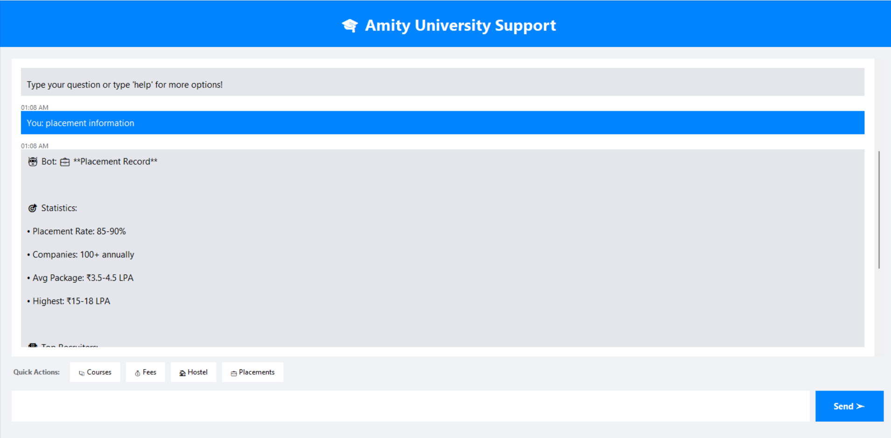
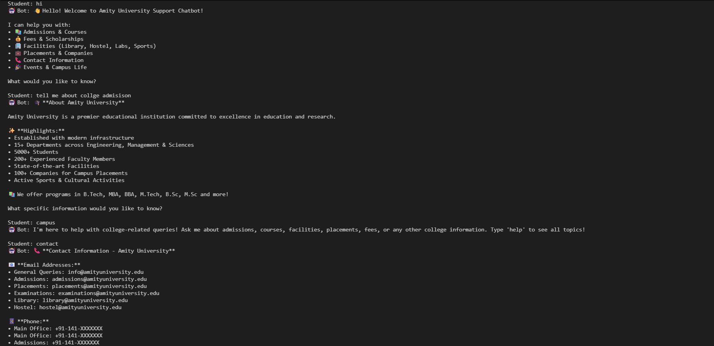

# 🎓 College Support Chatbot

An intelligent AI-powered chatbot to help students with college-related queries. Built using HuggingFace Transformers and Python.

[](https://www.python.org/)
[](https://huggingface.co/)

---

## ✨ Features

- 🤖 **AI-Powered Responses** - Uses Microsoft's DialoGPT model
- 💬 **Dual Interface** - Both command-line and GUI versions
- 📚 **Comprehensive Info** - Admissions, courses, fees, placements, facilities
- ⚡ **Fast & Efficient** - Optimized for CPU (no GPU needed)
- 🎨 **User-Friendly GUI** - Clean, modern interface with quick actions

---

## 🚀 Installation

```bash
# Clone the repository
git clone https://github.com/Sandeep-khatri01/chatbot.git
cd chatbot

# Install dependencies
pip install -r requirements.txt

# Run the GUI version
python chatbot_gui.py
```

**Requirements:**
- Python 3.7 or higher
- 4GB+ RAM
- Internet connection (first run to download model)

---

## 💡 Usage

### GUI Version (Recommended)
```bash
python chatbot_gui.py
```

### CLI Version
```bash
python chatbot_cli.py
```

### Example Queries
- "What courses do you offer?"
- "Tell me about hostel facilities"
- "What are the admission requirements?"
- "Placement statistics and companies"
- "Library timings"
- "How to apply for scholarships?"

Type `help` to see all available topics.

---

## 🛠️ Tech Stack

- **Python** - Core programming language
- **HuggingFace Transformers** - NLP library
- **DialoGPT-medium** - Conversational AI model (345M parameters)
- **PyTorch** - Deep learning framework
- **Tkinter** - GUI framework

---

## 📁 Project Structure

```
college-support-chatbot/
├── chatbot_gui.py          # GUI application
├── chatbot_cli.py          # Command-line interface
├── requirements.txt        # Python dependencies
├── README.md               # This file
└── screenshots/            # Application screenshots
```

---

## 🔧 How It Works

The chatbot uses a hybrid approach:

1. **Knowledge Base**: Pre-defined answers for common college queries (admissions, courses, fees, etc.)
2. **AI Fallback**: Uses DialoGPT for general conversation and complex questions
3. **Smart Matching**: Keyword-based pattern recognition for accurate responses

```
User Query → Keyword Match → Found? → Knowledge Base Answer
                          → Not Found? → AI Generated Response
```

---

## 📸 Screenshots

### Main Interface


### Chat Example


---

## 🎯 What Can It Answer?

- 📚 **Academics**: Courses, programs, departments
- 🎓 **Admissions**: Eligibility, entrance exams, deadlines
- 💰 **Financial**: Fees, scholarships, payment options
- 🏢 **Facilities**: Library, hostel, labs, sports, cafeteria
- 💼 **Career**: Placement stats, companies, packages
- 📝 **Exams**: Schedule, results, revaluation
- 🎉 **Campus Life**: Events, activities, clubs
- 📞 **Contact**: Email, phone, address
